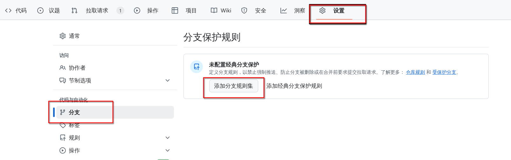

# 简介

1. 使用 tyr-rust-bootcamp 的 github organizations 来管理项目，防止变成一个很大的 workspace


# 安装

# 工具

## cargo-generate

> 生成项目模板的工具

1. 可以使用已有的 github repo 作为模板，生成项目

```bash
# 安装
cargo install cargo-generate

# 创建新的项目
cargo generate scau-coderlin/template
```


## pre-commit

> pre-commit 是一个代码检查工具，可以在提交代码前进行代码检查。

1. 安装成功后运行 `pre-commit install` 即可。
2. 检查配置文件位于项目的 `.pre-commit-config.yaml` 文件

```sh
# 安装
pacman -S pre-commit # pipx install pre-commit
```


3. 配置文件模板

```yaml
fail_fast: false
repos:
  - repo: https://github.com/pre-commit/pre-commit-hooks
    rev: v4.3.0
    hooks:
      - id: check-byte-order-marker
      - id: check-case-conflict
      - id: check-merge-conflict
      - id: check-symlinks
      - id: check-yaml
      - id: end-of-file-fixer
      - id: mixed-line-ending
      - id: trailing-whitespace
  - repo: https://github.com/psf/black
    rev: 22.10.0
    hooks:
      - id: black
  - repo: local
    hooks:
      - id: cargo-fmt
        name: cargo fmt
        description: Format files with rustfmt.
        entry: bash -c 'cargo fmt -- --check'
        language: rust
        files: \.rs$
        args: []
      - id: cargo-deny
        name: cargo deny check
        description: Check cargo dependencies
        entry: bash -c 'cargo deny check -d'
        language: rust
        files: \.rs$
        args: []
      - id: typos
        name: typos
        description: check typo
        entry: bash -c 'typos'
        language: rust
        files: \.*$
        pass_filenames: false
      - id: cargo-check
        name: cargo check
        description: Check the package for errors.
        entry: bash -c 'cargo check --all'
        language: rust
        files: \.rs$
        pass_filenames: false
      - id: cargo-clippy
        name: cargo clippy
        description: Lint rust sources
        entry: bash -c 'cargo clippy --all-targets --all-features --tests --benches -- -D warnings'
        language: rust
        files: \.rs$
        pass_filenames: false
      - id: cargo-test
        name: cargo test
        description: unit test for the project
        entry: bash -c 'cargo nextest run --all-features --no-tests pass'
        language: rust
        files: \.rs$
        pass_filenames: false

```


4. clone一个项目进来的时候，需要显式地安装一下：

```bash
# 在项目根目录下
pre-commit install
```


5. 例子：

```sh
# 代码修改后，提交代码
git commit -a
```


## Cargo deny

> Cargo deny 是一个 Cargo 插件，可以用于检查依赖的安全性。

1. 可以用于检查许可证，避免商业检查; 如果供应链有知名的安全问题的话，也会被扫描出来，并给出建议
2. 使用的是项目的 `deny.toml` 文件

```sh
cargo install --locked cargo-deny

# 初始化项目的deny.toml文件c
cargo deny init
```


3. 配置文件模板：

```toml
# This template contains all of the possible sections and their default values

# Note that all fields that take a lint level have these possible values:
# * deny - An error will be produced and the check will fail
# * warn - A warning will be produced, but the check will not fail
# * allow - No warning or error will be produced, though in some cases a note
# will be

# The values provided in this template are the default values that will be used
# when any section or field is not specified in your own configuration

# If 1 or more target triples (and optionally, target_features) are specified,
# only the specified targets will be checked when running `cargo deny check`.
# This means, if a particular package is only ever used as a target specific
# dependency, such as, for example, the `nix` crate only being used via the
# `target_family = "unix"` configuration, that only having windows targets in
# this list would mean the nix crate, as well as any of its exclusive
# dependencies not shared by any other crates, would be ignored, as the target
# list here is effectively saying which targets you are building for.
targets = [
  # The triple can be any string, but only the target triples built in to
  # rustc (as of 1.40) can be checked against actual config expressions
  #{ triple = "x86_64-unknown-linux-musl" },
  # You can also specify which target_features you promise are enabled for a
  # particular target. target_features are currently not validated against
  # the actual valid features supported by the target architecture.
  #{ triple = "wasm32-unknown-unknown", features = ["atomics"] },
]

# This section is considered when running `cargo deny check advisories`
# More documentation for the advisories section can be found here:
# https://embarkstudios.github.io/cargo-deny/checks/advisories/cfg.html
[advisories]
# The path where the advisory database is cloned/fetched into
db-path = "~/.cargo/advisory-db"
# The url(s) of the advisory databases to use
db-urls = ["https://github.com/rustsec/advisory-db"]
# The lint level for security vulnerabilities
vulnerability = "deny"
# The lint level for unmaintained crates
# 实际上，unmaintained 属于 [advisories] 配置下的一个选项，但它的值必须是以下之一：
# "all"
# "workspace"
# "transitive"
# "none"
# 它表示对哪些 crate 检查“是否无人维护”（即 crates.io 上标记为 unmaintained 的包）。
# 如果你只想检查工作区内的直接依赖
# unmaintained = "workspace"
# 检查所有依赖（包括传递依赖）是否有 unmaintained 的 crate
unmaintained = "all"
# The lint level for crates that have been yanked from their source registry
yanked = "warn"
# The lint level for crates with security notices. Note that as of
# 2019-12-17 there are no security notice advisories in
# https://github.com/rustsec/advisory-db
notice = "warn"
# A list of advisory IDs to ignore. Note that ignored advisories will still
# output a note when they are encountered.
ignore = [
  #"RUSTSEC-0000-0000",
]
# Threshold for security vulnerabilities, any vulnerability with a CVSS score
# lower than the range specified will be ignored. Note that ignored advisories
# will still output a note when they are encountered.
# * None - CVSS Score 0.0
# * Low - CVSS Score 0.1 - 3.9
# * Medium - CVSS Score 4.0 - 6.9
# * High - CVSS Score 7.0 - 8.9
# * Critical - CVSS Score 9.0 - 10.0
#severity-threshold =

# This section is considered when running `cargo deny check licenses`
# More documentation for the licenses section can be found here:
# https://embarkstudios.github.io/cargo-deny/checks/licenses/cfg.html
[licenses]
# The lint level for crates which do not have a detectable license
unlicensed = "allow"
# List of explicitly allowed licenses
# See https://spdx.org/licenses/ for list of possible licenses
# [possible values: any SPDX 3.7 short identifier (+ optional exception)].
allow = [
  "MIT",
  "Apache-2.0",
  "Unicode-DFS-2016",
  "MPL-2.0",
  "BSD-2-Clause",
  "BSD-3-Clause",
  "ISC",
  "CC0-1.0",
]
# List of explicitly disallowed licenses
# See https://spdx.org/licenses/ for list of possible licenses
# [possible values: any SPDX 3.7 short identifier (+ optional exception)].
deny = [
  #"Nokia",
]
# Lint level for licenses considered copyleft
copyleft = "warn"
# Blanket approval or denial for OSI-approved or FSF Free/Libre licenses
# * both - The license will be approved if it is both OSI-approved *AND* FSF
# * either - The license will be approved if it is either OSI-approved *OR* FSF
# * osi-only - The license will be approved if is OSI-approved *AND NOT* FSF
# * fsf-only - The license will be approved if is FSF *AND NOT* OSI-approved
# * neither - This predicate is ignored and the default lint level is used
allow-osi-fsf-free = "neither"
# Lint level used when no other predicates are matched
# 1. License isn't in the allow or deny lists
# 2. License isn't copyleft
# 3. License isn't OSI/FSF, or allow-osi-fsf-free = "neither"
default = "deny"
# The confidence threshold for detecting a license from license text.
# The higher the value, the more closely the license text must be to the
# canonical license text of a valid SPDX license file.
# [possible values: any between 0.0 and 1.0].
confidence-threshold = 0.8
# Allow 1 or more licenses on a per-crate basis, so that particular licenses
# aren't accepted for every possible crate as with the normal allow list
exceptions = [
  # Each entry is the crate and version constraint, and its specific allow
  # list
  #{ allow = ["Zlib"], name = "adler32", version = "*" },
]

# Some crates don't have (easily) machine readable licensing information,
# adding a clarification entry for it allows you to manually specify the
# licensing information
#[[licenses.clarify]]
# The name of the crate the clarification applies to
#name = "ring"
# The optional version constraint for the crate
#version = "*"
# The SPDX expression for the license requirements of the crate
#expression = "MIT AND ISC AND OpenSSL"
# One or more files in the crate's source used as the "source of truth" for
# the license expression. If the contents match, the clarification will be used
# when running the license check, otherwise the clarification will be ignored
# and the crate will be checked normally, which may produce warnings or errors
# depending on the rest of your configuration
#license-files = [
# Each entry is a crate relative path, and the (opaque) hash of its contents
#{ path = "LICENSE", hash = 0xbd0eed23 }
#]

[licenses.private]
# If true, ignores workspace crates that aren't published, or are only
# published to private registries
ignore = false
# One or more private registries that you might publish crates to, if a crate
# is only published to private registries, and ignore is true, the crate will
# not have its license(s) checked
registries = [
  #"https://sekretz.com/registry
]

# This section is considered when running `cargo deny check bans`.
# More documentation about the 'bans' section can be found here:
# https://embarkstudios.github.io/cargo-deny/checks/bans/cfg.html
[bans]
# Lint level for when multiple versions of the same crate are detected
multiple-versions = "warn"
# Lint level for when a crate version requirement is `*`
wildcards = "allow"
# The graph highlighting used when creating dotgraphs for crates
# with multiple versions
# * lowest-version - The path to the lowest versioned duplicate is highlighted
# * simplest-path - The path to the version with the fewest edges is highlighted
# * all - Both lowest-version and simplest-path are used
highlight = "all"
# List of crates that are allowed. Use with care!
allow = [
  #{ name = "ansi_term", version = "=0.11.0" },
]
# List of crates to deny
deny = [
  # Each entry the name of a crate and a version range. If version is
  # not specified, all versions will be matched.
  #{ name = "ansi_term", version = "=0.11.0" },
  #
  # Wrapper crates can optionally be specified to allow the crate when it
  # is a direct dependency of the otherwise banned crate
  #{ name = "ansi_term", version = "=0.11.0", wrappers = [] },
]
# Certain crates/versions that will be skipped when doing duplicate detection.
skip = [
  #{ name = "ansi_term", version = "=0.11.0" },
]
# Similarly to `skip` allows you to skip certain crates during duplicate
# detection. Unlike skip, it also includes the entire tree of transitive
# dependencies starting at the specified crate, up to a certain depth, which is
# by default infinite
skip-tree = [
  #{ name = "ansi_term", version = "=0.11.0", depth = 20 },
]

# This section is considered when running `cargo deny check sources`.
# More documentation about the 'sources' section can be found here:
# https://embarkstudios.github.io/cargo-deny/checks/sources/cfg.html
[sources]
# Lint level for what to happen when a crate from a crate registry that is not
# in the allow list is encountered
unknown-registry = "warn"
# Lint level for what to happen when a crate from a git repository that is not
# in the allow list is encountered
unknown-git = "warn"
# List of URLs for allowed crate registries. Defaults to the crates.io index
# if not specified. If it is specified but empty, no registries are allowed.
allow-registry = ["https://github.com/rust-lang/crates.io-index"]
# List of URLs for allowed Git repositories
allow-git = []

[sources.allow-org]
# 1 or more github.com organizations to allow git sources for
github = []
# 1 or more gitlab.com organizations to allow git sources for
gitlab = []
# 1 or more bitbucket.org organizations to allow git sources for
bitbucket = []

```


## typos

> typos 是一个拼写检查工具。

```bash
cargo install typos-cli
```


配置文件：项目目录下的 `_typos.toml` 文件。

```toml
[default.extend-words]

# 排除需要做拼写检查的目录
[files]
extend-exclude = ["CHANGELOG.md", "notebooks/*"]
```


## git cliff

> git cliff 是一个生成 changelog 的工具。

```bash
cargo install git-cliff
```


配置文件是项目目录下的 `cliff.toml` 文件

- changelog关心哪些东西，怎么处理

```toml
# git-cliff ~ configuration file
# https://git-cliff.org/docs/configuration

[changelog]
# changelog header
header = """
# Changelog\n
All notable changes to this project will be documented in this file. See [conventional commits](https://www.conventionalcommits.org/) for commit guidelines.\n
"""
# template for the changelog body
# https://keats.github.io/tera/docs/#introduction
body = """
---
\
    \
        ## [{{ version | trim_start_matches(pat="v") }}]($REPO/compare/{{ previous.version }}..{{ version }}) - {{ timestamp | date(format="%Y-%m-%d") }}
    \
        ## [{{ version | trim_start_matches(pat="v") }}] - {{ timestamp | date(format="%Y-%m-%d") }}
    \
\
    ## [unreleased]
\

    ### {{ group | striptags | trim | upper_first }}
    
        - **({{commit.scope}})** [**breaking**] \
            {{ commit.message|trim }} - ([{{ commit.id | truncate(length=7, end="") }}]($REPO/commit/{{ commit.id }})) - {{ commit.author.name }}
    
    \n\
    
        
        
            -  [**breaking**]\
                {{ commit.message|trim }} - ([{{ commit.id | truncate(length=7, end="") }}]($REPO/commit/{{ commit.id }})) - {{ commit.author.name }}
        
    
\n
"""
# template for the changelog footer
footer = """
<!-- generated by git-cliff -->
"""
# remove the leading and trailing whitespace from the templates
trim = true
# postprocessors
# 需要修改 replace 为自己的项目地址
postprocessors = [
    { pattern = '\$REPO', replace = "https://github.com/tyrchen/geektime-rust-live-coding" }, # replace repository URL
]

[git]
# parse the commits based on https://www.conventionalcommits.org
conventional_commits = true
# filter out the commits that are not conventional
filter_unconventional = false
# process each line of a commit as an individual commit
split_commits = false
# regex for preprocessing the commit messages
commit_preprocessors = [
    # { pattern = '\((\w+\s)?#([0-9]+)\)', replace = "([#${2}](https://github.com/orhun/git-cliff/issues/${2}))"}, # replace issue numbers
]
# regex for parsing and grouping commits
commit_parsers = [
    { message = "\\[skip", skip = true },
    { message = "\\p{Han}", skip = true },
    { message = "^feat", group = "Features" },
    { message = "^fix", group = "Bug Fixes" },
    { message = "^doc", group = "Documentation" },
    { message = "^perf", group = "Performance" },
    { message = "^refactor", group = "Refactoring" },
    { message = "^style", group = "Style" },
    { message = "^revert", group = "Revert" },
    { message = "^test", group = "Tests" },
    { message = "^chore\\(version\\):", skip = true },
    { message = "^chore", group = "Miscellaneous Chores" },
    { message = ".*", group = "Other" },
    { body = ".*security", group = "Security" },
]
# protect breaking changes from being skipped due to matching a skipping commit_parser
protect_breaking_commits = false
# filter out the commits that are not matched by commit parsers
filter_commits = false
# regex for matching git tags
tag_pattern = "v[0-9].*"
# regex for skipping tags
skip_tags = "v0.1.0-beta.1"
# regex for ignoring tags
ignore_tags = ""
# sort the tags topologically
topo_order = false
# sort the commits inside sections by oldest/newest order
sort_commits = "oldest"
# limit the number of commits included in the changelog.
# limit_commits = 42

```


## cargo nextest

> cargo nextest 是一个 Rust 增强测试工具。

```bash
cargo install cargo-nextest --locked
```


# 生成项目并初始化

## 生成项目

```bash
$ cargo generate scau-coderlin/template
⚠   Favorite `scau-coderlin/template` not found in config, using it as a git repository: https://github.com/scau-coderlin/template.git
🤷   Project Name: rcli

$ cd rcli

$ git add .
$ git commit -a

# 去github创建一个仓库

git remote add origin git@github.com:scau-coderlin/01-rcli.git
git branch -M main
git push -u origin main

# 修改readme

# 
pre-commit install

# 测试
git commit -a

# 推送
git push

# 生成tag
# git tag -a v0.1.2s
```


## 项目仓库git设置

### 合并

Settings -> general -> Pull Requests(拉去请求)

以一种怎么样的PR默认方式：squash merge，一个PR里的所有提交最终会被squash成一个提交，被合并到主线里


### 分支保护



Settings -> branches


## code reviews

- 架构：新的功能时，其架构怎么设计，是否符合良好的架构设计规范。
- 接口设计：功能并不复杂时，包括对外、对内; api、数据结构、方法、公共函数。
- 代码质量：最佳实践、可读性、性能、安全性。
- 错误处理，错误处理接口是否合理、处理范围
- 可维护性：
- 团队特定实践


# 变更流程

```sh
# 当发生改动时
# 可以使用 git diff 查看改动
git diff

# 切换到feature或者chore分支
git checkout -b chore/fix-cliff-config

git status

# 在这个分支里提交代码
git add .
git commit -a # git message: chore: correct the project url in  cliff config
git push origin chore/fix-cliff-config

# 在页面合并代码

# 删除分支
```


# 学习方法

1. 了解语言的思想、历史、现状、缺陷；
2. 掌握语言的语法、范式、约定、生态；
3. 撰写高质量系统：泛读、精读别人的源码，学习其架构、设计；
4. 综合所学知识，跨越语言的鸿沟。


# 基本概念

1. rust通过edition来向后兼容


# Rust语法

推荐使用 Learn X in Y minutes

```rust
// This is a comment. Line comments look like this...
// and extend multiple lines like this.

/* Block comments
  /* can be nested. */ */

/// Documentation comments look like this and support markdown notation.
/// # Examples
///
/// ```
/// let five = 5
/// ```

///////////////
// 1. Basics //
///////////////

#[allow(dead_code)]
// Functions
// `i32` is the type for 32-bit signed integers
fn add2(x: i32, y: i32) -> i32 {
    // Implicit return (no semicolon)
    x + y
}

#[allow(unused_variables)]
#[allow(unused_assignments)]
#[allow(dead_code)]
// Main function
fn main() {
    // Numbers //

    // Immutable bindings
    let x: i32 = 1;

    // Integer/float suffixes
    let y: i32 = 13i32;
    let f: f64 = 1.3f64;

    // Type inference
    // Most of the time, the Rust compiler can infer what type a variable is, so
    // you don’t have to write an explicit type annotation.
    // Throughout this tutorial, types are explicitly annotated in many places,
    // but only for demonstrative purposes. Type inference can handle this for
    // you most of the time.
    let implicit_x = 1;
    let implicit_f = 1.3;

    // Arithmetic
    let sum = x + y + 13;

    // Mutable variable
    let mut mutable = 1;
    mutable = 4;
    mutable += 2;

    // Strings //

    // String literals
    let x: &str = "hello world!";

    // Printing
    println!("{} {}", f, x); // 1.3 hello world!

    // A `String` – a heap-allocated string
    // Stored as a `Vec<u8>` and always holds a valid UTF-8 sequence, 
    // which is not null terminated.
    let s: String = "hello world".to_string();

    // A string slice – an immutable view into another string
    // This is basically an immutable pointer and length of a string – it
    // doesn’t actually contain the contents of a string, just a pointer to
    // the beginning and a length of a string buffer,
    // statically allocated or contained in another object (in this case, `s`).
    // The string slice is like a view `&[u8]` into `Vec<T>`.
    let s_slice: &str = &s;

    println!("{} {}", s, s_slice); // hello world hello world

    // Vectors/arrays //

    // A fixed-size array
    let four_ints: [i32; 4] = [1, 2, 3, 4];

    // A dynamic array (vector)
    let mut vector: Vec<i32> = vec![1, 2, 3, 4];
    vector.push(5);

    // A slice – an immutable view into a vector or array
    // This is much like a string slice, but for vectors
    let slice: &[i32] = &vector;

    // Use `{:?}` to print something debug-style
    println!("{:?} {:?}", vector, slice); // [1, 2, 3, 4, 5] [1, 2, 3, 4, 5]

    // Tuples //

    // A tuple is a fixed-size set of values of possibly different types
    let x: (i32, &str, f64) = (1, "hello", 3.4);

    // Destructuring `let`
    let (a, b, c) = x;
    println!("{} {} {}", a, b, c); // 1 hello 3.4

    // Indexing
    println!("{}", x.1); // hello

    //////////////
    // 2. Types //
    //////////////

    // Struct
    struct Point {
        x: i32,
        y: i32,
    }

    let origin: Point = Point { x: 0, y: 0 };

    // A struct with unnamed fields, called a ‘tuple struct’
    struct Point2(i32, i32);

    let origin2 = Point2(0, 0);

    // Basic C-like enum
    enum Direction {
        Left,
        Right,
        Up,
        Down,
    }

    let up = Direction::Up;

    // Enum with fields
    // If you want to make something optional, the standard
    // library has `Option`
    enum OptionalI32 {
        AnI32(i32),
        Nothing,
    }

    let two: OptionalI32 = OptionalI32::AnI32(2);
    let nothing = OptionalI32::Nothing;

    // Generics //

    struct Foo<T> { bar: T }

    // This is defined in the standard library as `Option`
    // `Option` is used in place of where a null pointer
    // would normally be used.
    enum Optional<T> {
        SomeVal(T),
        NoVal,
    }

    // Methods //

    impl<T> Foo<T> {
        // Methods take an explicit `self` parameter
        fn bar(&self) -> &T { // self is borrowed
            &self.bar
        }
        fn bar_mut(&mut self) -> &mut T { // self is mutably borrowed
            &mut self.bar
        }
        fn into_bar(self) -> T { // here self is consumed
            self.bar
        }
    }

    let a_foo = Foo { bar: 1 };
    println!("{}", a_foo.bar()); // 1

    // Traits (known as interfaces or typeclasses in other languages) //

    trait Frobnicate<T> {
        fn frobnicate(self) -> Option<T>;
    }

    impl<T> Frobnicate<T> for Foo<T> {
        fn frobnicate(self) -> Option<T> {
            Some(self.bar)
        }
    }

    let another_foo = Foo { bar: 1 };
    println!("{:?}", another_foo.frobnicate()); // Some(1)

    // Function pointer types // 

    fn fibonacci(n: u32) -> u32 {
        match n {
            0 => 1,
            1 => 1,
            _ => fibonacci(n - 1) + fibonacci(n - 2),
        }
    }

    type FunctionPointer = fn(u32) -> u32;

    let fib : FunctionPointer = fibonacci;
    println!("Fib: {}", fib(4)); // 5

    /////////////////////////
    // 3. Pattern matching //
    /////////////////////////

    let foo = OptionalI32::AnI32(1);
    match foo {
        OptionalI32::AnI32(n) => println!("it’s an i32: {}", n),
        OptionalI32::Nothing  => println!("it’s nothing!"),
    }

    // Advanced pattern matching
    struct FooBar { x: i32, y: OptionalI32 }
    let bar = FooBar { x: 15, y: OptionalI32::AnI32(32) };

    match bar {
        FooBar { x: 0, y: OptionalI32::AnI32(0) } =>
            println!("The numbers are zero!"),
        FooBar { x: n, y: OptionalI32::AnI32(m) } if n == m =>
            println!("The numbers are the same"),
        FooBar { x: n, y: OptionalI32::AnI32(m) } =>
            println!("Different numbers: {} {}", n, m),
        FooBar { x: _, y: OptionalI32::Nothing } =>
            println!("The second number is Nothing!"),
    }

    /////////////////////
    // 4. Control flow //
    /////////////////////

    // `for` loops/iteration
    let array = [1, 2, 3];
    for i in array {
        println!("{}", i);
    }

    // Ranges
    for i in 0u32..10 {
        print!("{} ", i);
    }
    println!("");
    // prints `0 1 2 3 4 5 6 7 8 9 `

    // `if`
    if 1 == 1 {
        println!("Maths is working!");
    } else {
        println!("Oh no...");
    }

    // `if` as expression
    let value = if true {
        "good"
    } else {
        "bad"
    };

    // `while` loop
    while 1 == 1 {
        println!("The universe is operating normally.");
        // break statement gets out of the while loop.
        //  It avoids useless iterations.
        break
    }

    // Infinite loop
    loop {
        println!("Hello!");
        // break statement gets out of the loop
        break
    }

    /////////////////////////////////
    // 5. Memory safety & pointers //
    /////////////////////////////////

    // Owned pointer – only one thing can ‘own’ this pointer at a time
    // This means that when the `Box` leaves its scope, it will be automatically deallocated safely.
    let mut mine: Box<i32> = Box::new(3);
    *mine = 5; // dereference
    // Here, `now_its_mine` takes ownership of `mine`. In other words, `mine` is moved.
    let mut now_its_mine = mine;
    *now_its_mine += 2;

    println!("{}", now_its_mine); // 7
    // println!("{}", mine); // this would not compile because `now_its_mine` now owns the pointer

    // Reference – an immutable pointer that refers to other data
    // When a reference is taken to a value, we say that the value has been ‘borrowed’.
    // While a value is borrowed immutably, it cannot be mutated or moved.
    // A borrow lasts from where it's created until its last use (Non-Lexical Lifetimes).
    let mut var = 4;
    var = 3;
    let ref_var: &i32 = &var;

    println!("{}", var); // Unlike `mine`, `var` can still be used
    println!("{}", *ref_var);
    // *ref_var = 6; // this would not compile, because `ref_var` is an immutable reference
    
    // After the last use of `ref_var` above, the borrow ends, so this reassignment is allowed.
    var = 2;

    // Mutable reference
    // While a value is mutably borrowed, it cannot be accessed at all.
    let mut var2 = 4;
    let ref_var2: &mut i32 = &mut var2;
    *ref_var2 += 2;         // '*' is used to point to the mutably borrowed var2

    println!("{}", *ref_var2); // 6 
    // ref_var2 is of type &mut i32, so stores a reference to an i32, not the value.
    
    // After the last use of `ref_var2` above, the borrow ends, so this reassignment is allowed.
    var2 = 2;
}
```


