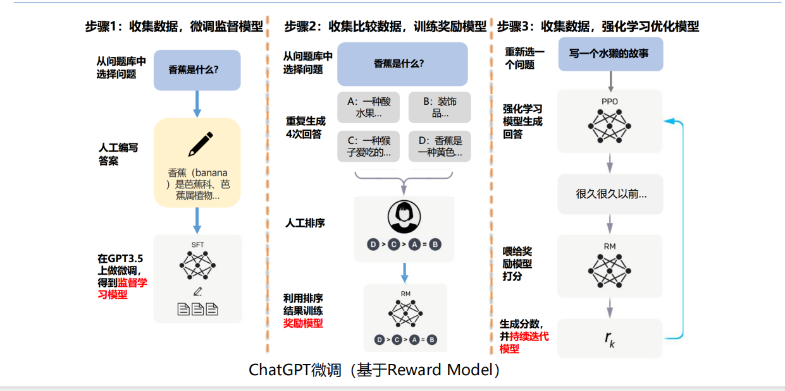
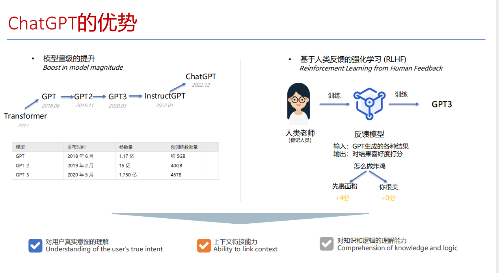

# AI大模型原理与API使用

1. 做一些智能的生成，结合工作流。
2. 单agent vs 多agent
3. 图像生成ai网站: liblib.art

## 什么是AI

> AI的核心目标是让机器能够执行通常需要人类智能的任务，例如语言理解、图像识别、解决复杂问题等

- 早期：硬编码---规则集（穷举
- 机器学习：通过数据训练模型，使机器能够**从数据中学习规律**。（参数化）
- 深度学习：利用**神经网络模拟人脑**的复杂结构，处理更复杂的任务。
- 大模型：以大规模**数据**和算力为基础，构建通用性强、性能卓越的AI模型（k2的参数量有1tb）

## AI的分类

### 分析式AI

- 也称为判别式AI,其核心任务是对已有数据进行**分类、预测或决策**。
- 优势在于其高精度和高效性，但其局限性在于仅能处理已有的数据，无法创造新内容。

### 生成式AI

- 专注于**创造新内容**，例如文本、图像、音频等
- 突破在于其创造性和灵活性，但也面临数据隐私、版权保护等挑战。

### 大语言模型LLM

- LLM是**基于海量文本数据训练的深度学习模型**，属于生成式AI的一种。它能理解和生成类人类的自然语言；常见模型如GPT、DeepSeek、Qwen等
- 具备强大的文本理解、摘要、翻译、问答以及内容创作能力。通过上下文关联，能进行连贯且富有逻辑的对话与写作。并且通过少量示例可以进行下游任务的学习。

应用场景：

- 智能客服
- 内容创作：例如生成广告文案、社交媒体帖文与博客文章；已知有团队用于写小红书文案。

### 生图/生视频模型

> 生图/生视频模型（Text-to-Image/Video）

- 专门**将文字描述转换为全新的图像或视频**。它们学习了图像、视频与其对应文字标签之间的关联，代表模型有DALL-E、Midjourney及Sora。
- 能够根据用户输入的文字提示（Prompt），创造出符合描述且风格多样的视觉内容。模型能融合不同概念、属性和风格，生成前所未有的原创作品。
- 网站：
    - liblib.art
    - jimeng.jianying.com/ai-tool (例如： 一款具有未来感的流线型运动跑鞋，采用回收海洋塑料材质)

### 视觉识别模型

#### 视觉识别模型

> Computer Vision Model

- 视觉识别模型让计算机能“看懂”并解析图像与视频内容，属于计算机视觉领域。主要任务包括图像分类、 物体检测、图像分割等，模型如YOLO、ResNet。 
- 能准确辨识影像中的物体、人脸、文字或特定场景。其核心在于从像素中**提取特征，并与已知模式进行比对，以完成识别、定位或追踪等任务**。
- 应用场景：
    - 智能制造： 在生产线上部署视觉识别系统，能即时检测产品外观的微小瑕疵，如刮痕或缺件，自动剔除不合格品，确保出厂品质，准确率远超人眼。
    - 医疗影像分析： 医院导入AI辅助判读系统，分析X光或CT扫描影像。模型能快速标记出疑似肿瘤或病变的区域，协助放射科医生提高诊断效率与准确性。

#### 自动驾驶

> Autonomous Drving Model

- 一套复杂的AI系统，**整合了视觉识别、传感器融合、决策规划等多种模型**。其目标是让车辆在无需人类干预下安全行驶，是AI技术的高度整合应用。 
- 通过摄像头、激光雷达(LiDAR)等传感器，即时感知周遭环境，识别行人、车辆与交通标志。模型会预测其他物体的动态，并规划出最佳的行驶路径与操作。 
- 场景示例： 
    - 无人配送 
    - 高级辅助驾驶

## 大语言模型

大语言模型是一种通用自然语言生成模型，使用大量预料数据训练，以实现生成文本、回答问题、对话生成等

- 基本能力：
    - 语言生成 
    - 上下文学习 
    - 世界知识
- 超能力：
    - 响应人类指令 
    - 泛化到没有见过的任务 
    - 代码生成和代码理解

### 如何训练

1. 收集数据，微调**监督模型**。

2. 收集比较数据，训练**奖励模型**。

    - **强化学习**，机器自己学习，给出（多个）答案，人类给予反馈（评分或者排序）。
    - 用排序任务替代打分任务，更容易让标注员给出统一的标注结果
    - Rank List 标注平台（鼓励创新，屏蔽不好的答案）。

3. 收集数据，强化学习优化模型（持续迭代模型

    对于新的问题，强化学习模型生成回答，喂给奖励模型打分排序，持续迭代模型

## Token

> 不同语言模型的Token是如何定义的？

- Token是大型语言模型处理文本的最小单位，由于模型本身无法直接理解文字，因此需要将文本切分成一个个Token，再将Token转换为数字（向量）进行运算。不同的模型使用不同的分词器（Tokenizer）来定义Token。
- 例如，对于英文Hello World：
    - GPT-4o会切分为["Hello", "world"] => 对应token id = [13226, 5922]
- 分词方式的不同会直接影响模型的效率和对语言细节的理解能力。
    - https://tiktokenizer.vercel.app 可以看到不同模型是如何切分输入的文本的

### 模型的常见特殊token

为了让模型更好地理解文本的结构和指令，开发者会预设一些具有特殊功能的Token；这些Token不代表具体词义，而是作为一种标点或命令存在。

分隔符：用于区分不同的文本段落或角色。比如，在对话中区分用户和AI的发言，可能会用<|user|>和<|assistant|>这样的token。

结束符：告知模型文本已经结束，可以停止生成了。常见的如[EOS]或<|endoftext|>。这对于确保模型生成完整且不冗长的回答至关重要。

起始符：标记序列的开始，例如`[CLS](CLassification)`或`[BOS](Begining of Sentence)`，帮助模型准备开始处理文本。

大模型攻击

例如让其评分一篇论文，在论文上加上特定的指令，但是人是无法直接识别这个指令的

## Temperature、TopP的原理与作用

作用：控制LLM生成文本的多样性，但原理不同。

### Temperature（温度）

原理：在模型计算出下一个Token所有可能的概率分布后，Temperature会调整这个分布的平滑度。

高Temperature（如1.0+）：会让低概率的Token更容易被选中，使生成结果更具创造性，可能出现不连贯的词语。

低Temperature（如0.2）：会让高概率的Token权重更大，使其生成结果更稳定、更符合训练数据，但会更保守。

### TopP（核采样）

原理：它设定一个概率阈值（P），然后从高到低累加所有Token的概率，直到总和超过P为止。模型只会在这个累加出来的核心词汇表中选择下一个token.

- 高TopP（如0.9）：候选词汇表比较大，结果更多样。
- 低TopP（如0.1）：候选词汇表非常小，结果更具确定性

相比Temperature, TopP能更动态地调整候选词的数量，避免选到概率极低的离谱词汇=>产生更高质量的文本

### Example

假设模型要完成句子：今天天气真...

模型预测下一个词可能是：好（60%）、不错（30%）、糟（9%）、可乐（0.01%）

高Temperature：会提升所有词的概率，使得可乐这个不相干的词也有机会被选中。

TopP（设为0.9）：会选择概率总和达到90%的词。这里好（60%）+不错（30%）=90%，所以模型只会在好和不错中选择，直接排除了可乐这种离谱的选项。

## AI大模型聊天产品的超能力

### 超能力1：联网搜索

弥补LLM训练数据截止日期的限制=>获取外部信息

当用户提问涉及最新资讯时，系统会识别出这一需求，自动调用搜索Tool,并将问题转化为多个简洁的搜索关键词。接着，程序会调用搜索引擎API（如google搜索）获取信息。

最后，这些实时信息会作为上下文提供给模型，由模型进行总结和提炼，生成精准且与时俱进的回答。

